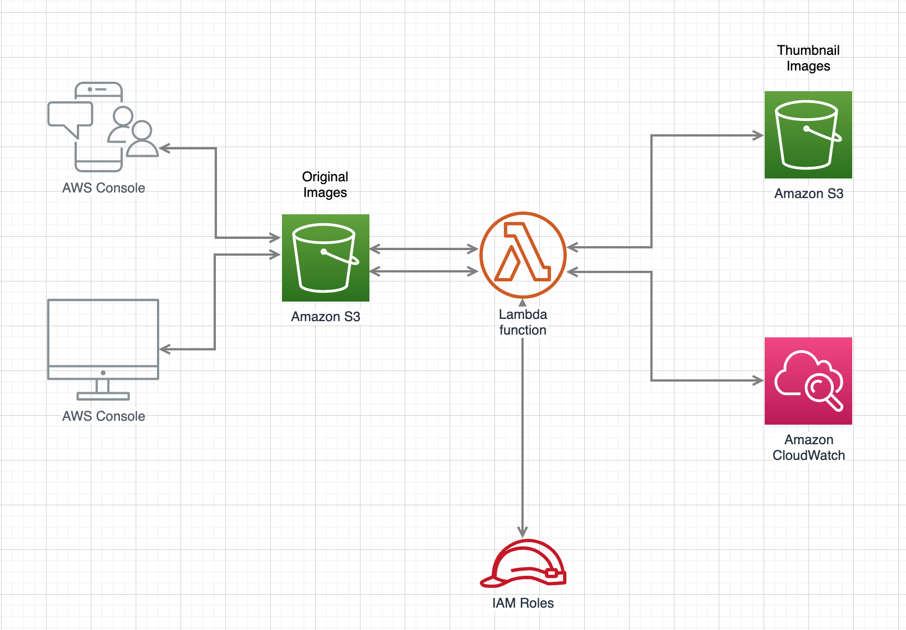
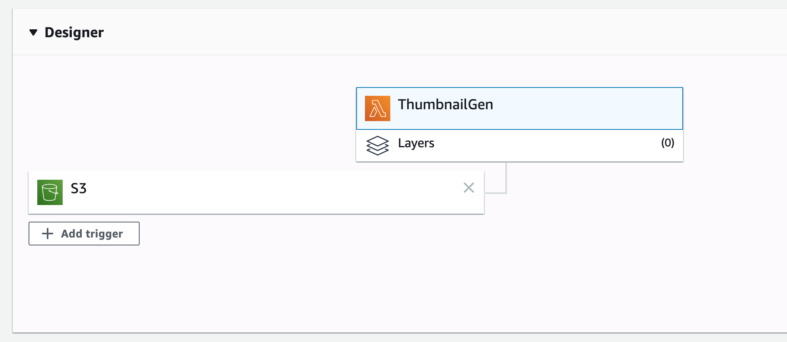

## AWS Lambda Thumbnail Service Serverless API
This is a sample that shows how we can build a NodeJS AWS Lambda service that is triggered from an S3 bucket image file upload, and then it processes the file and generate a small thumbnail image as an output in another bucket. The following diagram illustrates the design:



## How to build this sample
It is already built and ready to be uploaded to AWS.

However, you can built it using the following command line.
```
npm install --arch=x64 --platform=linux async sharp
```

## How to use this sample
It is ready to be uploaded to AWS.

### You need to do two main changes
1. Change `destBucket` inside index.js to the name of your destination bucket name:
```
var destBucket = "processed-thumbnail-images";
```

2. After uploading Lambda code, just make sure to wire a source S3 bucket as the trigger for this Lambda function as shown below.



